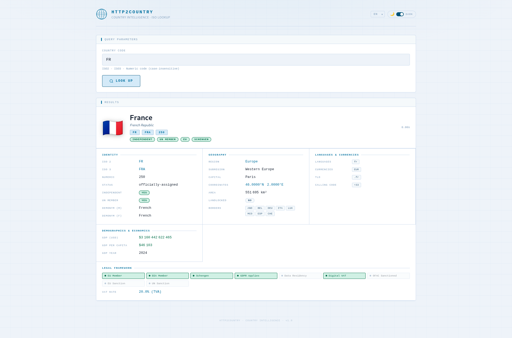

# http2country

> **Country Intelligence over HTTP** — A lightweight HTTP gateway that exposes full country data as a JSON REST API.

Built in Go, it accepts a `POST` request with a country identifier (ISO 3166-1 alpha-2, alpha-3, or numeric code) and returns structured country data sourced from a **self-built mmdb database** — constructed from a gzipped CSV served by the **letstool CDN** (`https://cdn.letstool.net/country/csv`), with zero runtime dependencies.

---

## Screenshot



> The embedded web UI (served at `/`) provides an interactive form to query countries by ISO2, ISO3, or numeric code. It supports **dark and light themes** and is fully translated into **15 languages**.

---

## Disclaimer

This project is released **as-is**, for demonstration or reference purposes.
It is **not maintained**: no bug fixes, dependency updates, or new features are planned. Issues and pull requests will not be addressed.

---

## License

This project is licensed under the **MIT License** — see the [`LICENSE`](LICENSE) file for details.

```
MIT License — Copyright (c) 2026 letstool.net
```

---

## Why CDN

Country data is aggregated from multiple public sources — ISO 3166-1 registries, World Bank datasets, UN membership records, FATF and OFAC sanction lists, EU/EEA/Schengen membership data, and more. Fetching and reconciling these sources on every instance would be fragile, bandwidth-intensive, and difficult to keep consistent across deployments.

Instead, I aggregate, normalise, and maintain the dataset on my own infrastructure and distribute it as a single gzipped CSV from a personal CDN (`cdn.letstool.net`). Every `http2country` instance fetches from this CDN rather than from the upstream sources directly.

**The data itself is free.** Anyone can run `http2country` without a `LICENSE_KEY` and get the full country database, with no registration required.

---

## Features

- Single static binary — no external runtime dependencies
- Embedded web UI and OpenAPI 3.1 specification (`/openapi.json`)
- **Self-builds its own mmdb** from a gzipped CSV fetched from the **letstool CDN** (`https://cdn.letstool.net/country/csv`) — no MaxMind account required
- **CDN-efficient**: uses `If-Modified-Since` / `304 Not Modified` to avoid redundant downloads when the data has not changed
- Accepts **ISO 3166-1 alpha-2** (`FR`), **alpha-3** (`FRA`), and **numeric** (`250`) codes — case-insensitive
- **41 fields per country**: identity, geography, languages, currencies, calling codes, TLDs, demographics, GDP/Gini, and full legal framework
- Legal framework fields: EU, EEA, Schengen, GDPR, data residency, VAT rate, digital VAT, OFAC sanctions, EU sanctions, UN sanctions, FATF status
- Automatic database refresh **every 24 hours** (hardcoded); scheduler adapts to CDN signals:
  - **429** — deferred to the CDN `Retry-After` timestamp
  - **410** — retried after 24 h, 48 h, 72 h, 96 h, then stopped permanently
  - **401** — update process stopped immediately with the server's error message logged
- **`/db/country` endpoint**: serves the current `country.mmdb` for peer sync
- Configurable listen address and database path
- Web UI available in **dark and light mode**, switchable at runtime
- Web UI fully translated into **15 languages**: Arabic (`ar`), Bengali (`bn`), German (`de`), English (`en`), Spanish (`es`), French (`fr`), Hindi (`hi`), Indonesian (`id`), Japanese (`ja`), Korean (`ko`), Portuguese (`pt-BR`), Russian (`ru`), Urdu (`ur`), Vietnamese (`vi`), Chinese (`zh-CN`)
- Right-to-left (RTL) layout for Arabic and Urdu, with automatic direction detection
- Docker image built on `scratch` — minimal attack surface

---

## How it works

```
Startup / Periodic update (every 24 hours, or adjusted on CDN signal)
       │
       ▼
GET https://cdn.letstool.net/country/csv
  If-Modified-Since: <last seen>
  Authorization: Basic <LICENSE_KEY>  (if configured)
       │
       ├─ 304 Not Modified  → keep current DB, update timestamp, resume 4h cycle
       ├─ 429 Too Many Requests → log Retry-After, defer next attempt to that timestamp
       ├─ 410 Gone          → product disabled; retry in 24h → 48h → 72h → 96h → STOP
       ├─ 401 Unauthorized  → log server message, stop update process permanently
       └─ 200 OK → gzip-decompress → parse CSV → reset 410 counter
       │
       ▼
Parse CSV rows → one country per row (41 columns)
       │
       ▼
Encode each country as a synthetic /128 IPv6 key derived from its ISO2 code
       │
       ▼
Build country.mmdb via mmdbwriter (MaxMind-compatible format)
       │
       ▼
Atomic swap: serve new DB while old requests finish
       │
       ▼
POST /api/v1/country  ──▶  normalise code (ISO2/ISO3/numeric) → mmdb lookup  ──▶  JSON response
```

The CSV (~250 country rows, 41 columns) is fetched, decompressed on the fly, and compiled into an mmdb in milliseconds. `If-Modified-Since` prevents unnecessary downloads and CDN quota consumption when the data has not changed since the last fetch.

---

## Prerequisites

- [Go](https://go.dev/dl/) **1.24+**
- Outbound HTTPS access to `cdn.letstool.net` at startup and every 24 hours

---

## Build

### Native binary (Linux)

```bash
bash scripts/linux_build.sh
```

The binary is output to `./out/http2country`.

The script produces a **fully static binary** (no libc dependency):

```bash
CGO_ENABLED=0 go build \
    -trimpath \
    -ldflags="-extldflags -static -s -w" \
    -o ./out/http2country ./cmd/http2country
```

### Windows

```cmd
scripts\windows_build.cmd
```

### Docker image

```bash
bash scripts/docker_build.sh
```

Two-stage Docker build:
1. **Builder** — `golang:1.24-alpine` compiles a static binary
2. **Runtime** — `scratch` image, containing only the binary and CA certificates

The resulting image is tagged `letstool/http2country:latest`.

---

## Run

### Native (Linux)

```bash
bash scripts/linux_run.sh
```

### Windows

```cmd
scripts\windows_run.cmd
```

### Docker

```bash
bash scripts/docker_run.sh
```

Equivalent to:

```bash
docker run -it --rm \
  -p 8080:8080 \
  -v ./db:/data:rw \
  -e LISTEN_ADDR=0.0.0.0:8080 \
  letstool/http2country:latest
```

On first run, the server fetches the gzipped CSV from the CDN, builds the mmdb, and starts serving. This takes a few seconds. Once running, the service is available at [http://localhost:8080](http://localhost:8080).

---

## Configuration

Each setting can be provided as a CLI flag or an environment variable. The CLI flag always takes priority. Resolution order: **CLI flag → environment variable → default**.

The database refresh interval is **fixed at 24 hours** and is not configurable. The scheduler adapts to CDN signals: a `429` defers the next attempt to the `Retry-After` unix timestamp; a `410` triggers a progressive backoff (24 h → 48 h → 72 h → 96 h) then a permanent stop; a `401` stops the update process immediately.

| CLI flag       | Environment variable | Default          | Description                                                                                     |
|----------------|----------------------|------------------|-------------------------------------------------------------------------------------------------|
| `-listen-addr` | `LISTEN_ADDR`        | `127.0.0.1:8080` | Address and port the HTTP server listens on.                                                    |
| `-db-dir`      | `COUNTRY_DB_DIR`     | `/data`          | Directory used to store and cache the `country.mmdb` file.                                      |
| `-db-url`      | `COUNTRY_DB_URL`     | *(none)*         | Base URL of a peer http2country instance (e.g. `http://host:8080`). When set, enables **peer mode**: the database is downloaded from the peer's `/db/country` endpoint instead of being fetched from the CDN. |

**Proxy environment variables** (no CLI flag — standard curl-compatible convention):

| Variable | Description |
|---|---|
| `HTTPS_PROXY` / `https_proxy` | Proxy URL for HTTPS requests (CDN and peer downloads). E.g. `http://proxy.corp:3128` or `socks5://proxy.corp:1080`. |
| `HTTP_PROXY` / `http_proxy`   | Proxy URL for plain HTTP requests. |
| `NO_PROXY` / `no_proxy`       | Comma-separated list of hosts or CIDRs to bypass the proxy (e.g. `localhost,10.0.0.0/8`). |

The proxy is configured using Go's standard `http.ProxyFromEnvironment` — identical behaviour to curl. The effective proxy URL is logged at startup.

**Examples:**

```bash
# Default mode: fetch from CDN anonymously every 24 hours
./out/http2country -listen-addr 0.0.0.0:8080

# CDN mode through a corporate HTTP proxy
HTTPS_PROXY=http://proxy.corp:3128 ./out/http2country

# CDN mode through a SOCKS5 proxy
HTTPS_PROXY=socks5://proxy.corp:1080 ./out/http2country

# Peer mode: sync from an upstream instance
./out/http2country -db-url http://upstream-host:8080

# Using environment variables (peer mode)
COUNTRY_DB_URL=http://upstream-host:8080 ./out/http2country

# Custom database directory
COUNTRY_DB_DIR=/opt/countrydb ./out/http2country
```

---

## Database management

On startup, the server checks whether a cached `country.mmdb` exists in `COUNTRY_DB_DIR` and whether it is still within the configured refresh interval. If the database is absent or too old, it triggers an immediate update.

The update strategy depends on whether `COUNTRY_DB_URL` is set:

### Mode 1 — CDN CSV build (default, `COUNTRY_DB_URL` unset)

The server fetches a gzipped CSV from the letstool CDN:
```
GET https://cdn.letstool.net/country/csv
If-Modified-Since: <previous Last-Modified>
```

The CDN responds with:
- **200 OK** — gzipped CSV; parsed and compiled into `country.mmdb`. The 410 retry counter is reset to zero.
- **304 Not Modified** — data unchanged; current DB is kept, timestamp updated (no quota consumed)
- **429 Too Many Requests** — rate-limited; the `Retry-After` header (unix timestamp) is logged; next update deferred to that timestamp
- **410 Gone** — the product is currently disabled on the CDN; the scheduler retries after 24 h, then 48 h, 72 h, 96 h. If the 5th consecutive attempt still returns 410, the update process is stopped permanently. A successful 200 at any point resets the retry counter.
- **401 Unauthorized** — the `LICENSE_KEY` does not grant access to this product; the server message is logged and the update process is stopped permanently. Check your `LICENSE_KEY` / `-license-key` configuration.

The `Last-Modified` value from each 200 response is stored in `.last_modified_country` and sent as `If-Modified-Since` on subsequent requests to avoid redundant downloads.

### Mode 2 — Peer sync (`COUNTRY_DB_URL` set)

The server downloads `country.mmdb` directly from the `/db/country` endpoint of another running `http2country` instance. No CDN access is needed. Useful for:
- Air-gapped or restricted environments
- High-availability clusters where only one node fetches from the CDN
- Reducing CDN quota consumption

```bash
./out/http2country -db-url http://upstream-host:8080
```

In both modes, the database is refreshed **every 24 hours**. CDN-specific signals (429, 410, 401) only affect CDN CSV build mode; peer mode retries on the normal 4-hour interval regardless. Atomic hot-swap guarantees zero downtime during updates.

---

## API Reference

### `POST /api/v1/country`

Returns full structured data for a country, looked up by any ISO 3166-1 code format.

#### Request body

The `country` field accepts ISO2, ISO3, or numeric codes — case-insensitive.

```json
{ "country": "FR" }
```

```json
{ "country": "FRA" }
```

```json
{ "country": "250" }
```

#### Response body

```json
{
  "status": "SUCCESS",
  "answer": {
    "iso2": "FR",
    "iso3": "FRA",
    "numeric_code": "250",
    "fifa": "FRA",
    "status": "officially-assigned",
    "independent": true,
    "un_member": true,
    "name_common": "France",
    "name_official": "French Republic",
    "flag_emoji": "🇫🇷",
    "region": "Europe",
    "subregion": "Western Europe",
    "capital": "Paris",
    "latitude": 46.0,
    "longitude": 2.0,
    "area_sq_km": 551695.0,
    "landlocked": false,
    "borders": ["AND", "BEL", "DEU", "ITA", "LUX", "MCO", "ESP", "CHE"],
    "language_codes": ["fr"],
    "currency_codes": ["EUR"],
    "tld": [".fr"],
    "calling_codes": ["+33"],
    "demonym_eng_m": "French",
    "demonym_eng_f": "French",
    "gini_year": "2018",
    "gini_value": 32.4,
    "gdp_current_usd": 2957880384000.0,
    "gdp_per_capita_usd": 43658.98,
    "gdp_year": "2022",
    "legal_eu": true,
    "legal_eea": true,
    "legal_schengen": true,
    "legal_gdpr": true,
    "legal_data_residency": false,
    "legal_vat_rate": 20.0,
    "legal_vat_name": "TVA",
    "legal_digital_vat": true,
    "legal_ofac": false,
    "legal_eu_sanction": false,
    "legal_un_sanction": false,
    "legal_fatf": ""
  }
}
```

#### Status values

| Value      | Meaning                                                               |
|------------|-----------------------------------------------------------------------|
| `SUCCESS`  | Country found; `answer` contains the full country record.            |
| `NOTFOUND` | The code was valid but not found in the database.                    |
| `ERROR`    | Malformed request, empty code, or database not yet initialised.      |

#### `CountryAnswer` fields

| Field                | Type       | Description                                                        |
|----------------------|------------|--------------------------------------------------------------------|
| `iso2`               | `string`   | ISO 3166-1 alpha-2 code (e.g. `FR`)                               |
| `iso3`               | `string`   | ISO 3166-1 alpha-3 code (e.g. `FRA`)                              |
| `numeric_code`       | `string`   | ISO 3166-1 numeric code, zero-padded (e.g. `250`)                 |
| `fifa`               | `string`   | FIFA country code                                                  |
| `status`             | `string`   | Assignment status (e.g. `officially-assigned`)                     |
| `independent`        | `bool`     | Whether the country is considered independent                      |
| `un_member`          | `bool`     | Whether the country is a UN member state                           |
| `name_common`        | `string`   | Common name (e.g. `France`)                                        |
| `name_official`      | `string`   | Official name (e.g. `French Republic`)                             |
| `flag_emoji`         | `string`   | Unicode flag emoji (e.g. `🇫🇷`)                                  |
| `region`             | `string`   | Continental region (e.g. `Europe`)                                 |
| `subregion`          | `string`   | Subregion (e.g. `Western Europe`)                                  |
| `capital`            | `string`   | Capital city                                                       |
| `latitude`           | `number`   | Geographic centre latitude                                         |
| `longitude`          | `number`   | Geographic centre longitude                                        |
| `area_sq_km`         | `number`   | Land area in km²                                                   |
| `landlocked`         | `bool`     | Whether the country is landlocked                                  |
| `borders`            | `string[]` | Bordering country ISO2 codes                                       |
| `language_codes`     | `string[]` | Official language codes                                            |
| `currency_codes`     | `string[]` | Currency codes (ISO 4217)                                          |
| `tld`                | `string[]` | Country-code top-level domains                                     |
| `calling_codes`      | `string[]` | International dialling prefixes (e.g. `+33`)                      |
| `demonym_eng_m`      | `string`   | Male demonym in English (e.g. `French`)                            |
| `demonym_eng_f`      | `string`   | Female demonym in English                                          |
| `gini_year`          | `string`   | Year of the Gini coefficient measurement                           |
| `gini_value`         | `number`   | Gini coefficient (income inequality, 0–100)                        |
| `gdp_current_usd`    | `number`   | GDP in current USD                                                 |
| `gdp_per_capita_usd` | `number`   | GDP per capita in current USD                                      |
| `gdp_year`           | `string`   | Year of the GDP measurement                                        |
| `legal_eu`           | `bool`     | European Union member                                              |
| `legal_eea`          | `bool`     | European Economic Area member                                      |
| `legal_schengen`     | `bool`     | Schengen Area member                                               |
| `legal_gdpr`         | `bool`     | GDPR applies                                                       |
| `legal_data_residency` | `bool`   | Data residency requirements in force                               |
| `legal_vat_rate`     | `number`   | Standard VAT rate (%)                                              |
| `legal_vat_name`     | `string`   | Local VAT name (e.g. `TVA`, `MwSt`, `IVA`)                        |
| `legal_digital_vat`  | `bool`     | Digital services VAT applies                                       |
| `legal_ofac`         | `bool`     | OFAC (US Treasury) sanctioned                                      |
| `legal_eu_sanction`  | `bool`     | EU sanctioned                                                      |
| `legal_un_sanction`  | `bool`     | UN sanctioned                                                      |
| `legal_fatf`         | `string`   | FATF status: `""` (no concern), `"grey-list"`, or `"black-list"`  |

#### curl examples

```bash
# Lookup by ISO2
curl -s -X POST http://localhost:8080/api/v1/country \
  -H "Content-Type: application/json" \
  -d '{"country":"FR"}' | jq .

# Lookup by ISO3
curl -s -X POST http://localhost:8080/api/v1/country \
  -H "Content-Type: application/json" \
  -d '{"country":"DEU"}' | jq .

# Lookup by numeric code
curl -s -X POST http://localhost:8080/api/v1/country \
  -H "Content-Type: application/json" \
  -d '{"country":"392"}' | jq .

# Lowercase input is accepted
curl -s -X POST http://localhost:8080/api/v1/country \
  -H "Content-Type: application/json" \
  -d '{"country":"es"}' | jq .
```

### `GET /db/country`

Serves the current `country.mmdb` file. Useful for downloading the database or for peer-mode synchronisation.

### `GET /openapi.json`

Returns the full OpenAPI 3.1 specification.

### `GET /`

Returns the embedded interactive web UI.

---

## Development

```bash
# Tidy dependencies
bash scripts/000_init.sh

# Build native binary
bash scripts/linux_build.sh

# Run
bash scripts/linux_run.sh

# Smoke tests (server must be running)
bash scripts/999_test.sh
```

---

## AI-Assisted Development

This project was developed with the assistance of **[Claude Sonnet 4.6](https://www.anthropic.com/claude)** by Anthropic.

---

## Attribution

Country data aggregated from public sources including the ISO 3166 Maintenance Agency, World Bank Open Data, UN membership records, FATF public lists, and OFAC/EU sanctions registries. This project is not affiliated with or endorsed by any of these organisations.

---

## See also

| Project | GitHub | Docker Hub | Description |
|---|---|---|---|
| `http2tor` | [letstool/http2tor](https://github.com/letstool/http2tor) | [letstool/http2tor](https://hub.docker.com/r/letstool/http2tor) | Lightweight HTTP gateway exposing Tor network detection as a JSON REST API |
| `http2geoip` | [letstool/http2geoip](https://github.com/letstool/http2geoip) | [letstool/http2geoip](https://hub.docker.com/r/letstool/http2geoip) | Lightweight stateless HTTP gateway exposing IP geolocation as a JSON REST API |
| `http2cert` | [letstool/http2cert](https://github.com/letstool/http2cert) | [letstool/http2cert](https://hub.docker.com/r/letstool/http2cert) | Lightweight stateless HTTP gateway exposing X.509 certificate inspection as a JSON REST API |
| `http2dns` | [letstool/http2dns](https://github.com/letstool/http2dns) | [letstool/http2dns](https://hub.docker.com/r/letstool/http2dns) | Lightweight stateless HTTP gateway exposing DNS queries as a JSON REST API |
| `http2whois` | [letstool/http2whois](https://github.com/letstool/http2whois) | [letstool/http2whois](https://hub.docker.com/r/letstool/http2whois) | Lightweight stateless HTTP gateway exposing WHOIS queries as a JSON REST API |
| `http2sun` | [letstool/http2sun](https://github.com/letstool/http2sun) | [letstool/http2sun](https://hub.docker.com/r/letstool/http2sun) | Lightweight stateless HTTP gateway exposing solar position data as a JSON REST API |
| `http2mac` | [letstool/http2mac](https://github.com/letstool/http2mac) | [letstool/http2mac](https://hub.docker.com/r/letstool/http2mac) | Lightweight stateless HTTP gateway exposing MAC address OUI database as a JSON REST API |
| `http2country` | [letstool/http2country](https://github.com/letstool/http2country) | [letstool/http2country](https://hub.docker.com/r/letstool/http2country) | Lightweight HTTP gateway exposing country intelligence data as a JSON REST API |
